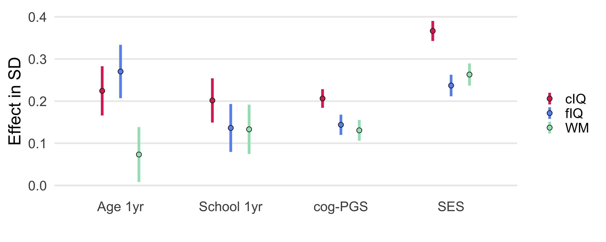
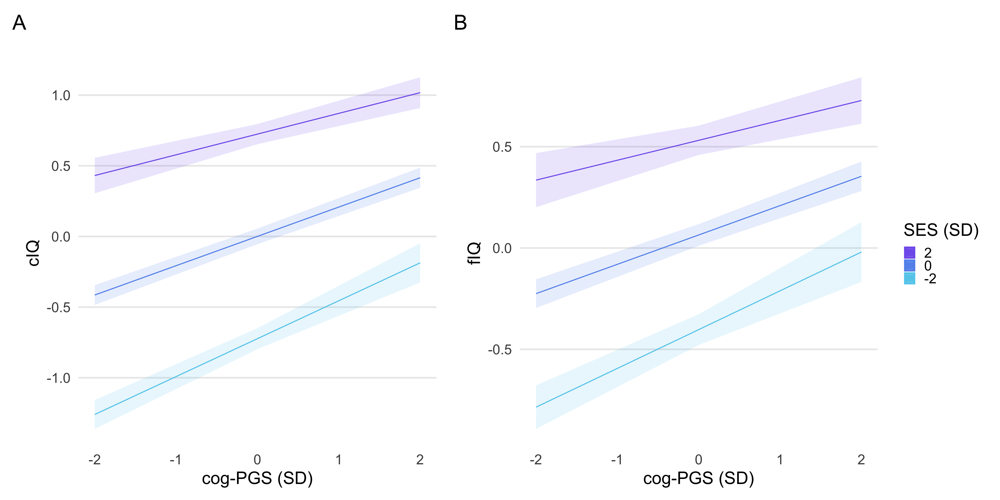

# Schooling substantially improves intelligence, but neither lessens nor widens the impacts of socioeconomics and genetics. 

Nicholas Judd, Bruno Sauce & Torkel Klinberg  
Department of Neuroscience  
Karolinska Institute  
Stockholm, Sweden  
Jul 11th, 2021  

| [Click here for a preprint](https://psyarxiv.com/96pj4/) | 
| :-: |

 

## Abstract

Schooling, socioeconomic status (SES), and genetics all impact intelligence. However, it is unclear to what extent their contributions are unique and if they interact. Here we used a multi-trait polygenic score for cognition (cogPGS) with a quasi-experimental regression discontinuity design to isolate how months of schooling relate to intelligence in 6,567 children (aged 9-11). We found large, independent effects of schooling (β ~ .15), cogPGS (β ~ .10), and SES (β ~ .20) on working memory, crystallized (cIQ), and fluid intelligence (fIQ). Notably, two years of schooling had a larger effect on intelligence than the lifetime consequences, since birth, of SES or cogPGS based inequalities. However, schooling showed no interaction with cogPGS or SES for the three intelligence domains tested. While schooling had strong main effects on intelligence, it did not lessen, nor widen the impact of these preexisting SES or genetic factors.

## Overview of the repository

See: **schooling_analysis.R**

This repository includes all code to replicate every result, figure and table in the manuscript. We could not release the data as you need to request access from NDA to get data from ABCD. Yet we have kept the orginal file names in the data directory.

We computed cog-PGS inhouse, unforntuely due to a NDA policies we cannot share it and had to delete it.