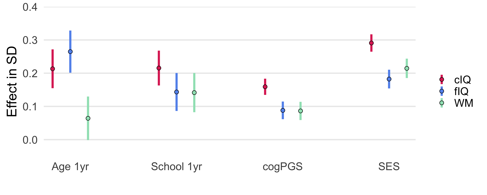

# The malleability of intelligence: the effects of schooling, genetic factors, socioeconomic status, and their interplay in children. 

Nicholas Judd, Bruno Sauce & Torkel Klinberg  
Department of Neuroscience  
Karolinska Institute  
Stockholm, Sweden  
Jul 11th, 2021  

| [Click here for a preprint](https://psyarxiv.com/z3pb7/) | 
| :-: |

 

## Abstract

Schooling, socioeconomic status (SES), and genetics all play large roles in intelligence differences. However, it is unclear to what extent their contributions are unique and if they interact. Here we used a multitrait polygenic score for cognition (cog-PGS) with a quasi-experimental regression discontinuity design to isolate how months of schooling relate to intelligence in 7,853 children (aged 9-11). We found large independent effects of schooling, cog-PGS, and SES on working memory, crystallized (cIQ), and fluid intelligence (fIQ). Schooling showed no interaction with cog-PGS or SES for the three intelligence domains tested. Intriguingly, we found evidence for gene-by-environment interplay between cog-PGS and SES for cIQ, and a trend in the same direction for fIQ. This interaction was negative meaning that the intelligence of the highest SES children was the least affected by genetic differences, while the lowest SES children were most affected by genetic variability. This effect suggests that by lessening inequality we may, in turn, be able to also lessen the genetic differences in intelligence

## Overview of the repository

See: **schooling_analysis.R**

This repository includes all code to replicate every result, figure and table in the manuscript. We could not release the data as you need to request access from NDA to get data from ABCD. Yet we have kept the orginal file names in the data directory.

We computed cog-PGS inhouse, unforntuely due to a NDA policies we cannot share it and must deleted it within 6 months.